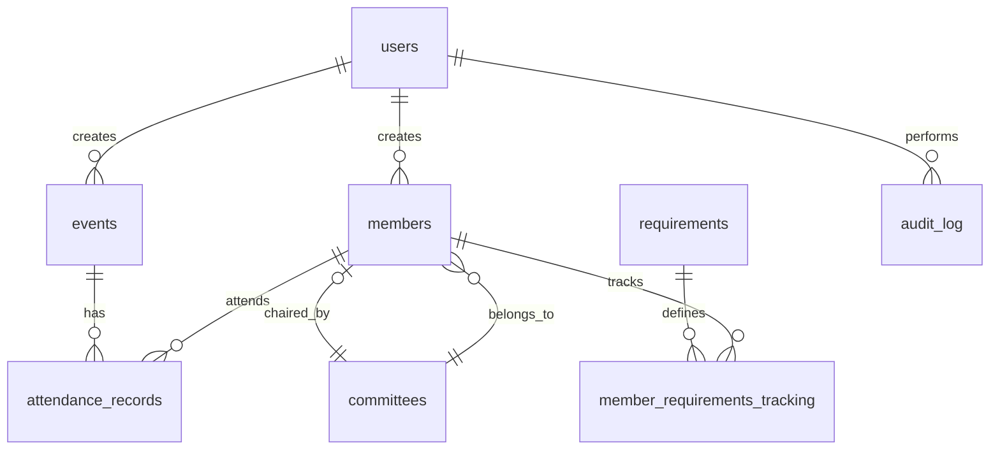

# Database Schema Design
## FBLA Membership Tracker

### Overview
This document defines the complete database schema for the FBLA Membership Tracker backend system. The schema uses PostgreSQL for production and SQLite for development.

### Database Naming Conventions
- **Tables**: Plural, snake_case (e.g., `members`, `events`, `attendance_records`)
- **Columns**: Singular, snake_case (e.g., `first_name`, `created_at`)
- **Primary Keys**: `id` (integer, auto-increment)
- **Foreign Keys**: `<table_name>_id` (e.g., `member_id`, `event_id`)
- **Timestamps**: All tables include `created_at` and `updated_at`
- **Indexes**: Named as `idx_<table>_<column(s)>`

## Core Tables

### 1. `users` (E-Board Login)
```sql
CREATE TABLE users (
    id INTEGER PRIMARY KEY AUTOINCREMENT,
    username VARCHAR(50) UNIQUE NOT NULL,
    email VARCHAR(255) UNIQUE NOT NULL,
    password_hash VARCHAR(255) NOT NULL,
    full_name VARCHAR(100) NOT NULL,
    is_active BOOLEAN DEFAULT TRUE,
    last_login TIMESTAMP,
    created_at TIMESTAMP DEFAULT CURRENT_TIMESTAMP,
    updated_at TIMESTAMP DEFAULT CURRENT_TIMESTAMP
);

-- Indexes
CREATE INDEX idx_users_email ON users(email);
CREATE INDEX idx_users_username ON users(username);
```

### 2. `members`
```sql
CREATE TABLE members (
    id INTEGER PRIMARY KEY AUTOINCREMENT,
    first_name VARCHAR(50) NOT NULL,
    last_name VARCHAR(50) NOT NULL,
    email VARCHAR(255) UNIQUE NOT NULL,
    student_id VARCHAR(20) UNIQUE,
    grade INTEGER CHECK (grade >= 9 AND grade <= 12),
    membership_type VARCHAR(20) NOT NULL DEFAULT 'General',
    -- Values: 'General', 'Committee', 'Cohort', 'E-Board'
    committee_name VARCHAR(50), -- Only if membership_type = 'Committee'
    status VARCHAR(20) NOT NULL DEFAULT 'Good Standing',
    -- Values: 'Good Standing', 'Probation', 'Inactive'
    phone_number VARCHAR(20),
    join_date DATE DEFAULT CURRENT_DATE,
    is_active BOOLEAN DEFAULT TRUE,
    notes TEXT,
    created_at TIMESTAMP DEFAULT CURRENT_TIMESTAMP,
    updated_at TIMESTAMP DEFAULT CURRENT_TIMESTAMP,
    created_by INTEGER REFERENCES users(id)
);

-- Indexes
CREATE INDEX idx_members_email ON members(email);
CREATE INDEX idx_members_student_id ON members(student_id);
CREATE INDEX idx_members_membership_type ON members(membership_type);
CREATE INDEX idx_members_status ON members(status);
CREATE INDEX idx_members_grade ON members(grade);
```

### 3. `events`
```sql
CREATE TABLE events (
    id INTEGER PRIMARY KEY AUTOINCREMENT,
    event_name VARCHAR(100) NOT NULL,
    event_type VARCHAR(50) NOT NULL,
    -- Values: 'General Meeting', 'Committee Meeting', 'Cohort Meeting',
    -- 'Workshop', 'Fundraiser', 'Competition', 'Social', 'Other'
    description TEXT,
    location VARCHAR(200),
    event_date DATE NOT NULL,
    start_time TIME NOT NULL,
    end_time TIME,
    qr_code_data VARCHAR(255) UNIQUE, -- Unique identifier for QR code
    is_mandatory_general BOOLEAN DEFAULT FALSE,
    is_mandatory_committee BOOLEAN DEFAULT FALSE,
    is_mandatory_cohort BOOLEAN DEFAULT FALSE,
    is_mandatory_eboard BOOLEAN DEFAULT FALSE,
    max_capacity INTEGER,
    current_attendance INTEGER DEFAULT 0,
    is_active BOOLEAN DEFAULT TRUE,
    created_at TIMESTAMP DEFAULT CURRENT_TIMESTAMP,
    updated_at TIMESTAMP DEFAULT CURRENT_TIMESTAMP,
    created_by INTEGER REFERENCES users(id)
);

-- Indexes
CREATE INDEX idx_events_event_date ON events(event_date);
CREATE INDEX idx_events_event_type ON events(event_type);
CREATE INDEX idx_events_qr_code ON events(qr_code_data);
```

### 4. `attendance_records`
```sql
CREATE TABLE attendance_records (
    id INTEGER PRIMARY KEY AUTOINCREMENT,
    member_id INTEGER REFERENCES members(id) ON DELETE CASCADE,
    event_id INTEGER REFERENCES events(id) ON DELETE CASCADE,
    check_in_time TIMESTAMP DEFAULT CURRENT_TIMESTAMP,
    -- Feedback fields from QR form
    meeting_rating INTEGER CHECK (meeting_rating >= 1 AND meeting_rating <= 10),
    nps_score INTEGER CHECK (nps_score >= 1 AND nps_score <= 10),
    positive_feedback TEXT,
    improvement_feedback TEXT,
    -- Tracking fields
    check_in_method VARCHAR(20) DEFAULT 'QR',
    -- Values: 'QR', 'Manual', 'Import'
    is_verified BOOLEAN DEFAULT FALSE,
    created_at TIMESTAMP DEFAULT CURRENT_TIMESTAMP,
    created_by INTEGER REFERENCES users(id),

    -- Prevent duplicate check-ins
    UNIQUE(member_id, event_id)
);

-- Indexes
CREATE INDEX idx_attendance_member ON attendance_records(member_id);
CREATE INDEX idx_attendance_event ON attendance_records(event_id);
CREATE INDEX idx_attendance_checkin ON attendance_records(check_in_time);
```

### 5. `requirements`
```sql
CREATE TABLE requirements (
    id INTEGER PRIMARY KEY AUTOINCREMENT,
    membership_type VARCHAR(20) NOT NULL,
    -- Values: 'General', 'Committee', 'Cohort', 'E-Board', 'All'
    requirement_type VARCHAR(50) NOT NULL,
    -- Values: 'Attendance', 'Competition', 'Volunteering', 'Fundraising'
    requirement_name VARCHAR(100) NOT NULL,
    description TEXT,
    minimum_value INTEGER NOT NULL, -- e.g., 5 meetings, 2 competitions
    period VARCHAR(20) DEFAULT 'Semester',
    -- Values: 'Monthly', 'Semester', 'Year'
    is_active BOOLEAN DEFAULT TRUE,
    created_at TIMESTAMP DEFAULT CURRENT_TIMESTAMP,
    updated_at TIMESTAMP DEFAULT CURRENT_TIMESTAMP
);

-- Indexes
CREATE INDEX idx_requirements_type ON requirements(membership_type);
CREATE INDEX idx_requirements_category ON requirements(requirement_type);
```

### 6. `member_requirements_tracking`
```sql
CREATE TABLE member_requirements_tracking (
    id INTEGER PRIMARY KEY AUTOINCREMENT,
    member_id INTEGER REFERENCES members(id) ON DELETE CASCADE,
    requirement_id INTEGER REFERENCES requirements(id),
    current_value INTEGER DEFAULT 0,
    is_met BOOLEAN DEFAULT FALSE,
    last_calculated TIMESTAMP,
    period_start DATE,
    period_end DATE,
    created_at TIMESTAMP DEFAULT CURRENT_TIMESTAMP,
    updated_at TIMESTAMP DEFAULT CURRENT_TIMESTAMP,

    UNIQUE(member_id, requirement_id, period_start)
);

-- Indexes
CREATE INDEX idx_tracking_member ON member_requirements_tracking(member_id);
CREATE INDEX idx_tracking_requirement ON member_requirements_tracking(requirement_id);
CREATE INDEX idx_tracking_met ON member_requirements_tracking(is_met);
```

### 7. `committees`
```sql
CREATE TABLE committees (
    id INTEGER PRIMARY KEY AUTOINCREMENT,
    committee_name VARCHAR(50) UNIQUE NOT NULL,
    description TEXT,
    chair_member_id INTEGER REFERENCES members(id),
    is_active BOOLEAN DEFAULT TRUE,
    created_at TIMESTAMP DEFAULT CURRENT_TIMESTAMP,
    updated_at TIMESTAMP DEFAULT CURRENT_TIMESTAMP
);

-- Indexes
CREATE INDEX idx_committees_name ON committees(committee_name);
```

### 8. `audit_log` (For tracking important changes)
```sql
CREATE TABLE audit_log (
    id INTEGER PRIMARY KEY AUTOINCREMENT,
    table_name VARCHAR(50) NOT NULL,
    record_id INTEGER NOT NULL,
    action VARCHAR(20) NOT NULL,
    -- Values: 'CREATE', 'UPDATE', 'DELETE'
    changes_json TEXT, -- JSON of what changed
    user_id INTEGER REFERENCES users(id),
    ip_address VARCHAR(45),
    created_at TIMESTAMP DEFAULT CURRENT_TIMESTAMP
);

-- Indexes
CREATE INDEX idx_audit_table ON audit_log(table_name);
CREATE INDEX idx_audit_record ON audit_log(record_id);
CREATE INDEX idx_audit_user ON audit_log(user_id);
CREATE INDEX idx_audit_created ON audit_log(created_at);
```

## Relationships Summary



## Key Business Rules Enforced by Schema

1. **Unique Constraints**:
   - No duplicate email addresses for members
   - No duplicate student IDs
   - One attendance record per member per event
   - Unique QR codes per event

2. **Data Integrity**:
   - Grade must be between 9-12
   - Ratings must be between 1-10
   - Membership types are restricted to defined values
   - Status values are restricted to defined values

3. **Referential Integrity**:
   - Cascading deletes for attendance when member/event deleted
   - Preserve audit trail even if user deleted (no cascade)

## Migration Notes

### Initial Setup Order:
1. Create `users` table first (no dependencies)
2. Create `members` table (depends on users)
3. Create `committees` table
4. Create `events` table (depends on users)
5. Create `attendance_records` table (depends on members, events, users)
6. Create `requirements` table
7. Create `member_requirements_tracking` table (depends on members, requirements)
8. Create `audit_log` table (depends on users)

### Sample Data for Testing:
```sql
-- Insert test E-Board user
INSERT INTO users (username, email, password_hash, full_name)
VALUES ('admin', 'admin@umd.edu', '<hashed_password>', 'Admin User');

-- Insert test members
INSERT INTO members (first_name, last_name, email, student_id, grade, membership_type)
VALUES
    ('John', 'Doe', 'jdoe@umd.edu', '123456', 10, 'General'),
    ('Jane', 'Smith', 'jsmith@umd.edu', '123457', 11, 'Cohort'),
    ('Bob', 'Wilson', 'bwilson@umd.edu', '123458', 12, 'E-Board');

-- Insert test event
INSERT INTO events (event_name, event_type, event_date, start_time, qr_code_data, is_mandatory_general)
VALUES ('November General Meeting', 'General Meeting', '2024-11-25', '15:00:00', 'QR_NOV_GM_2024', TRUE);
```

## Performance Considerations

1. **Indexes**: Created on all foreign keys and commonly queried fields
2. **Attendance Records**: May grow large - consider partitioning by year in production
3. **Audit Log**: Implement retention policy (e.g., keep 1 year of logs)
4. **Member Status**: Consider caching or materialized view for frequently accessed status calculations

## Security Notes

1. **Password Storage**: Never store plain text passwords - use bcrypt with salt
2. **PII Protection**: Email and student_id columns contain sensitive data
3. **Audit Trail**: Track all modifications to member and event data
4. **SQL Injection**: Use parameterized queries with SQLAlchemy ORM